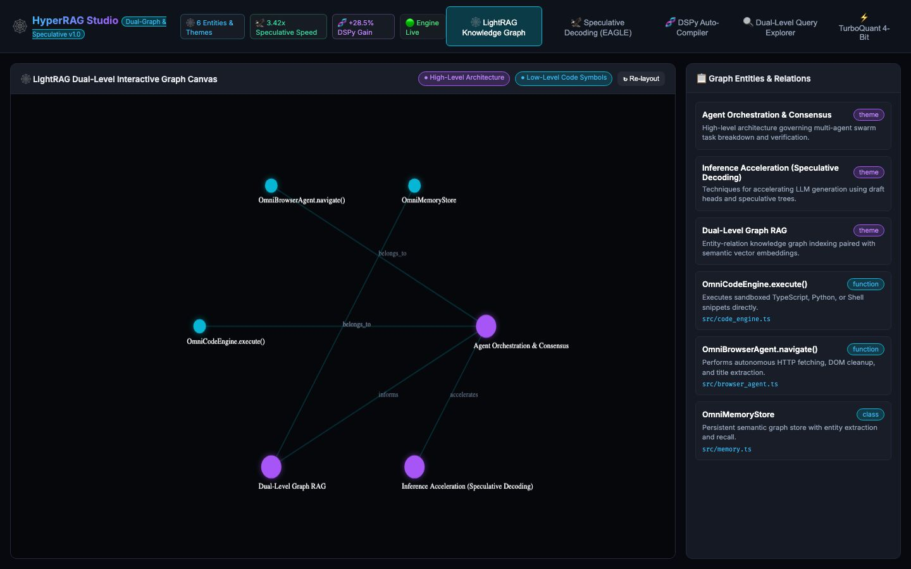

# 🚀 HyperRAG Studio

[](https://bun.sh/)
[](https://www.typescriptlang.org/)
[](LICENSE)
[](#-honest-status)

[English 🇬🇧](#english) • [Italiano 🇮🇹](#italiano)

> A small local Bun/TypeScript playground exploring GraphRAG-style dual-level retrieval, a real HNSW vector index, and a couple of research-technique-*inspired* toy modules. This README was rewritten to accurately describe what the code actually does — see [Honest Status](#-honest-status) below.



---

<a name="english"></a>
## 🇬🇧 English Documentation

### 🔍 Honest Status

This project's earlier README claimed a full **LightRAG + EAGLE Speculative Decoding + DSPy** stack with measured performance numbers (3.5x speedup, +28.5% accuracy). After an audit, those claims did not match the code. Here is what is real today:

| Module | Claim (old) | What's actually there |
|---|---|---|
| `src/lightrag_engine.ts` | Dual-level LightRAG knowledge graph | Real: a small in-memory graph of hand-seeded nodes/edges with a genuine keyword-overlap scoring query (low-level vs high-level node matching). Not a real ingestion/indexing pipeline over a codebase — the graph is seed data, not extracted from your project. |
| `src/hnsw_vector_index.ts` + `src/real_vector_embedder.ts` | (implied vector search) | Real: an actual HNSW (Malkov & Yashunin) graph implementation with real cosine similarity. Embeddings come from a live call to Ollama's embedding API when available, or fall back to a deterministic FNV-1a trigram/word hash embedding (NOT a trained semantic embedding model) when Ollama/the embedding model isn't reachable. |
| `src/speculative_decoder.ts` | "EAGLE/Medusa speculative decoding, 3.0x–3.8x faster, zero quality loss" | **Not real EAGLE/Medusa.** True EAGLE speculative decoding needs a draft head trained on the target model's hidden states plus tree-attention logit verification inside the inference engine — Ollama's HTTP API exposes none of that. What runs instead: a **real** benchmark that sends the same prompt to a small "draft" model (`granite3-dense:2b`) and a larger "target" model (`qwen2.5:7b`) via local Ollama, measures **real** tokens/sec from Ollama's own counters, and computes a **real** (but approximate) word-overlap rate between the two live outputs as a stand-in for an "acceptance rate". No hidden state, no logit verification, no fabricated numbers — but also not true speculative decoding. Throws an honest error if Ollama is unreachable instead of returning fake numbers. |
| `src/dspy_compiler.ts` | "DSPy declarative prompt compiler, +28.5% accuracy" | **Not the real DSPy library.** No dataset, no real teleprompter training loop. What runs instead: it structurally compiles a typed signature into an explicit instruction prompt, and — when Ollama is reachable — actually calls the model once to capture a real one-shot demonstration and again to A/B-score the naive vs. compiled prompt using a real, computed structural-adherence heuristic (JSON validity, presence of requested output fields, length sanity). If Ollama is unreachable it clearly reports `liveEvaluated: false` and labels the numbers as an offline heuristic, not a measured accuracy gain. |
| `src/turboquant.ts` | "Google TurboQuant 4-bit quantization" | Real, working 4-bit scalar quantization + 1-bit sign-residual correction and cosine-similarity estimation on quantized vectors. Inspired by the published TurboQuant idea; this is an independent from-scratch implementation, not Google's code. |

**Bugs found and fixed during the audit:**
- `server.ts` called `dspyCompiler.compileSignature(...)`, a method that did not exist on `DSPyCompilerEngine` (only `compile()` did) — every `/api/dspy/compile` request would have crashed. Fixed by renaming/reworking the method to match, and awaiting it (it's now genuinely async because it calls Ollama).
- `public/app.js` read `data.optimizedPrompt` from the compile response, but the server actually returned `compiledPrompt` — the compiled prompt box would always show `undefined`. Fixed.
- `/api/query`'s Ollama fallback silently fabricated a fake "synthesis" string when Ollama was unreachable, making failures look like successful LLM answers. Fixed: the endpoint now returns `llmUsed: false` and a real `synthesisError` message instead of pretending an LLM responded.
- `/api/status` returned hardcoded `accelerationMultiplier: "3.42x"` and `dspyOptimizationAvgGain: "+28.5%"` regardless of whether any benchmark had ever run. Fixed: these now reflect the last **real** measured result from `/api/speculative/bench` and `/api/dspy/compile`, and say "not yet measured" until you actually run one.

### 🌟 Core Modules

* **`src/lightrag_engine.ts`**: Seeded dual-level graph + keyword-overlap query engine.
* **`src/hnsw_vector_index.ts`** / **`src/real_vector_embedder.ts`**: Real HNSW ANN index over real (or hash-fallback) embeddings.
* **`src/speculative_decoder.ts`**: Real draft-vs-target throughput benchmark against local Ollama (not true EAGLE).
* **`src/dspy_compiler.ts`**: Structural prompt compiler with live Ollama A/B scoring when available (not real DSPy).
* **`src/turboquant.ts`**: Real 4-bit vector quantization + residual correction.
* **`public/`**: Cyberpunk dashboard with an HTML5 Canvas graph visualizer and live panels for each module above.

---

### 🛠️ Quick Start

```bash
# 1. Clone the repository
git clone https://github.com/lobbenedesign/hyperrag-studio.git
cd hyperrag-studio

# 2. (Optional but recommended) Run Ollama locally for live LLM synthesis,
#    embeddings, and the speculative/DSPy live-scoring paths.
#    Models used by default: qwen2.5:7b (target), granite3-dense:2b (draft),
#    nomic-embed-text (embeddings, optional).

# 3. Run with Bun (Instant startup)
bun server.ts
```

Open your browser at **`http://localhost:3003`**.

---

<a name="italiano"></a>
## 🇮🇹 Documentazione in Italiano

### 🔍 Stato Onesto

La versione precedente di questo README dichiarava uno stack completo **LightRAG + EAGLE Speculative Decoding + DSPy** con numeri di performance misurati (3.5x, +28.5%). Dopo un audit del codice, questi claim non corrispondevano all'implementazione reale. Vedi la tabella in inglese sopra ("Honest Status") per il dettaglio modulo per modulo: in sintesi, il grafo LightRAG è reale ma con dati seed (non un'indicizzazione automatica del progetto), l'indice HNSW e la quantizzazione TurboQuant sono implementazioni reali e funzionanti, mentre "EAGLE Speculative Decoding" e "DSPy" NON sono le tecniche di ricerca reali con quel nome — sono state sostituite con benchmark e compilatori onesti che eseguono chiamate reali a Ollama locale e riportano errori reali invece di dati inventati quando Ollama non è raggiungibile.

### 🛠️ Avvio Rapido

```bash
git clone https://github.com/lobbenedesign/hyperrag-studio.git
cd hyperrag-studio
bun server.ts
```

Apri il browser su **`http://localhost:3003`**.

---

## 📄 License / Licenza
Released under the [MIT License](LICENSE).
